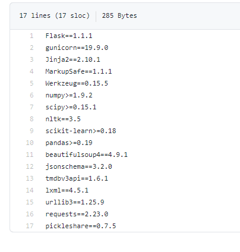

# Data Science Customer Churn: Project Overview

* Created a tool that estimates the success rate of the Kickstarter funding project to help an entrepreneur achieve a successful campaign.
* Optimised Linear, DecisionTree, and Random Forest Regression using GridsearchCV to reach the best model.
* Built a client-facing API using flask and Heroku to view that on the web.

# Code and Resources Used

**Python Version**: 3.7

**Packages**: pandas, numpy, sklearn, matplotlib, seaborn, flask, json, pickle

**For Web Framework Requirements**: pip install -r requirements.txt

**Data Resource (Kaggle)**: https://www.kaggle.com/emregur/churndata

# Data Cleaning and EDA

# Model Building 
First, I transformed the categorical variables into dummy variables. I also split the data into train and test sets with a test size of 20%.

I tried four different models and evaluated them using Precision, Recall and confusion matrix. I chose the confusion matrix because it is relatively easy to interpret.

I tried four different models:

Linear Logistic – Baseline for the model

Decision Tree and Kneighborsclassifier 

Random Forest – Again, with the sparsity associated with the data, I thought that this would be a good fit.

# Model Performance
The Random Forest model far outperformed the other approaches on the test and validation sets.

Random Forest :
Accurary score of 85.7% on Testing Data. 
Accurary score of 86.9% on Training Data. 

 # [Production](https://bankml.herokuapp.com/) 
 In this step, I built a client facing API endpoint and model was hosted on Heroku.
 
## Setup for Deployment of the model on Heroku:

1.Procfile

[2. App](https://github.com/Jaspreetsm21/Bank_churn_ML/blob/main/app.py)

python script for deploying the model using flask.

3.requirements

